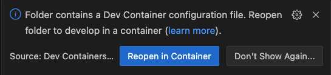

# Contributing

## Introduction

We appreciate your interest in contributing to NRedisStack.
Community contributions mean a lot to us.

## Contributions we need

You may already know how you'd like to contribute, whether it's a fix for a bug you
encountered, or a new feature your team wants to use.

If you don't know where to start, consider improving
documentation, triaging bugs, or writing tutorials. These are all examples of
helpful contributions that mean less work for you.

## Your First Contribution

Unsure where to begin contributing? You can start by looking through
[help-wanted
issues](https://github.com/redis/NRedisStack/labels/help-wanted).

Never contributed to open source before? Here are a couple of friendly
tutorials:

-   <http://makeapullrequest.com/>
-   <http://www.firsttimersonly.com/>

## Getting Started

Here's how to get started with your code contribution:

1.  Create your own fork of NRedisStack
2.  Do the changes in your fork
3.  Write your tests

4.  Use the `docker run -p 6379:6379 -it redis/redis-stack-server:edge` as your local environment for running the functional tests. You can also use Development Container as described below.
5.  Run dotnet format to make sure your code is formatted
6.  Make sure your tests pass using `dotnet test`
7.  Open a pull request

## Development Container

Development Containers are an easy way to define and setup a reproducible development environment by using containers.
NRedisStack provides a [development container environment](https://containers.dev/) that can be used to get running relatively fast without focusing on the different Redis deployments.

The development container comes packed with .NET 6 and 7, required by the testing suite, as well as the currently supported Redis versions that are run as part of the CI pipeline.

Development containers are supported in a few [editors](https://containers.dev/supporting#editors) or by using the [`devcontainer-cli` tool](https://github.com/devcontainers/cli).

This guide explains how to use the existing development container setup for this project.

### Prerequisites

Before you start, make sure you have the following installed:

- [Visual Studio Code](https://code.visualstudio.com/)
- [Dev Containers extension](https://marketplace.visualstudio.com/items?itemName=ms-vscode-remote.remote-containers) for VS Code

### Steps to Use the Existing Development Container Setup

1. **Clone the Project:** Start by cloning the project's repository to your local machine using Git.

2. **Install Prerequisites:** Ensure you have Visual Studio Code and the Dev Containers extension installed.

3. **Open in Development Container:**

   a. Open the cloned project directory using Visual Studio Code.

   b. VS Code should detect the `.devcontainer` folder and the associated configuration files.

   c. You will likely see a notification suggesting reopening the project in a development container:
   

   Click on this notification or press `Ctrl + Shift + P` (or `Cmd + Shift + P` on Mac) and type _"Dev Containers: Reopen in Container"_. Select the suggestion that appears.

   d. Visual Studio Code will build the Docker image according to the configuration and start a container using the specified setup.

4. **Develop Inside the DevContainer:**

   You're now working within the development container environment. Access extensions, dependencies, and settings specified in `devcontainer.json`. Edit code, use the integrated terminal, and run commands as usual.

5. **Save and Commit:**

   Changes made within the development container will be saved to your local repository. Use Git within the container to manage changes, create branches, commit, and push code.

6. **Stop the DevContainer:**

   Close the development container by clicking the "Close Remote Connection" button in the bottom-left corner of the VS Code window. This stops the container while preserving changes.

7. **Resume Work:**

   Reopen the project in the development container to work on it again using the same steps.

By using the existing `.devcontainer` setup, you benefit from a consistent development environment tailored to the project's requirements. For specific configuration details or issues, consult the project documentation or ask maintainers for assistance.


## Testing

Call `dotnet test` to run all tests

to test specific test you can use `--filter` flag:
```bash
dotnet test --filter <YourTestName>
```

If you want to run your tests against a specific host and port, you can do it thus:
```bash
dotnet test --environment="REDIS=<redisServer:port>"
```
e.g:
```bash
dotnet test --environment="REDIS=172.17.0.1:6379"
```

To run your tests against an oss cluster:
```bash
dotnet test --environment "REDIS_CLUSTER=<redisServer:port>" --environment "NUM_REDIS_CLUSTER_NODES=<number of nodes in the cluster>"
```
e.g. :
```bash
dotnet test --environment "REDIS_CLUSTER=127.0.0.1:16379" --environment "NUM_REDIS_CLUSTER_NODES=6"
```
## How to Report a Bug

### Security Vulnerabilities

**NOTE**: If you find a security vulnerability, do NOT open an issue.
Email [Redis Open Source (<oss@redis.com>)](mailto:oss@redis.com) instead.

In order to determine whether you are dealing with a security issue, ask
yourself these two questions:

-   Can I access something that's not mine, or something I shouldn't
    have access to?
-   Can I disable something for other people?

If the answer to either of those two questions are *yes*, then you're
probably dealing with a security issue. Note that even if you answer
*no*  to both questions, you may still be dealing with a security
issue, so if you're unsure, just email [us](mailto:oss@redis.com).

### Everything Else

When filing an issue, make sure to answer these five questions:

1.  What version of NRedisStack are you using?
2.  What version of redis are you using?
3.  What did you do?
4.  What did you expect to see?
5.  What did you see instead?

## Suggest a feature or enhancement

If you'd like to contribute a new feature, make sure you check our
issue list to see if someone has already proposed it. Work may already
be underway on the feature you want or we may have rejected a
feature like it already.

If you don't see anything, open a new issue that describes the feature
you would like and how it should work.

## Code review process

The core team regularly looks at pull requests. We will provide
feedback as as soon as possible. After receiving our feedback, please respond
within two weeks. After that time, we may close your PR if it isn't
showing any activity.
